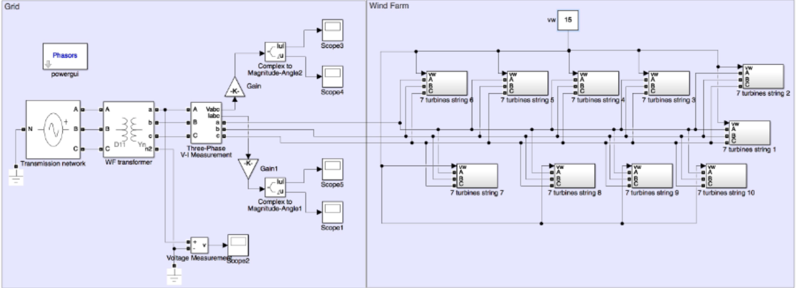

Codes and thesis can be seen [here](https://github.com/huacailong/Wind-Farm)

**Advisor**: Dr. Adrià Junyent-Ferre 
- Designed the mechanical models of a single wind turbine
- Designed a wind farm model connected to the electrical grid through interface model
- Applied the approach to release part of the kinetic energy stored in the rotating shafts by slowing the turbines to generate extra power when frequency changes

A wind farm, which is a group of several dozens of wind turbines, is connected to the electrical grid through wind turbine interface model. And it is depicted in the following. 

